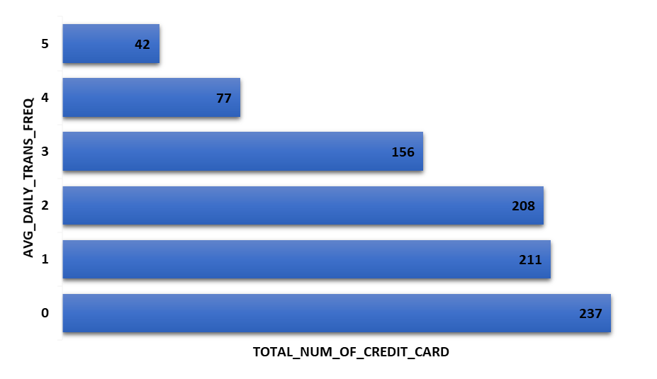
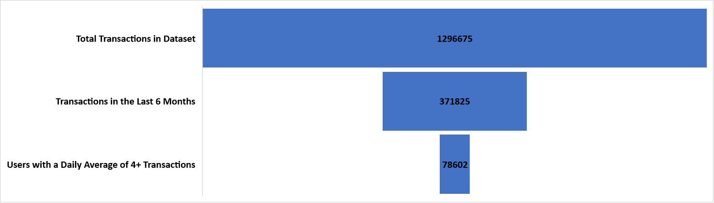
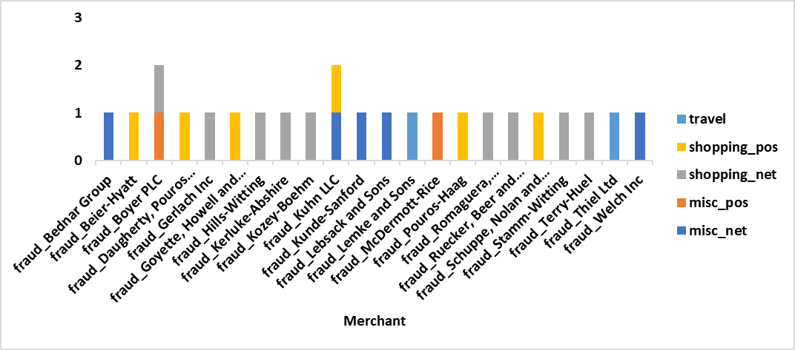
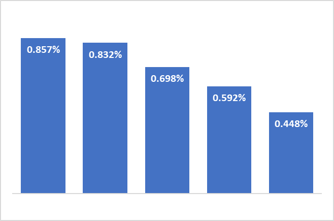

# Credit Card Transactions Analysis 

## 🚀 **Introduction**
This project focuses on analyzing financial credit card transaction data to identify patterns and features that may indicate potential fraudulent activities.  
The dataset consists of various attributes related to credit card transactions, such as transaction timestamps, merchant details, cardholder demographics, geographic information, and transaction characteristics.  
The primary aim of this analysis is to uncover which attributes most significantly contribute to the likelihood of fraud, helping to build insights into fraud detection and prevention.

The choice of this analysis stems largely from my background in fraud detection and my interest in the use of SQL for Data Analysis.

## 🗂️ **Dataset Overview**
The dataset was obtained from Kaggle Datasets and can be found [here on the Kaggle website](https://www.kaggle.com/datasets/priyamchoksi/credit-card-transactions-dataset).  
The dataset has over 1.85M rows records with details on credit card transactions, including transaction timestamps, amounts, cardholder details, merchant information, and geolocation data.  
This dataset supports various analyses, including fraud detection, customer segmentation, and anomaly detection.

### Dataset Columns
The dataset contains 23 columns, categorized as follows:

- **Transaction Details**: transaction_timestamp, transaction_number, unix_time
- **Cardholder Information**: credit_card_number, first_name, last_name, gender, date_of_birth
- **Merchant Information**: merchant, category, merchant_latitude, merchant_longitude, merchant_zip_code
- **Location Data**: street, city, state, zip, latitude, longitude, city_pop
- **Transaction Attributes**: amount, is_fraud

This analysis explores transaction patterns to identify features that may indicate higher fraud risk, using statistical analysis and visualization.  
By understanding these patterns, I aim to provide actionable insights for credit card fraud detection and risk management.

On average, credit card fraud rings typically operate on a group of compromised accounts for about 3 to 6 months before moving on, although this can vary widely based on detection and response times.  
The focus of this analysis is on the last six months of data, specifically from January 1, 2020, to June 2020, to align with typical fraud detection timelines.

## ❓ **Questions of Interest**
The following questions guided my analysis, aimed at identifying transaction anomalies and potential fraud indicators:
1. **High Transaction Frequency**: Which customers had the highest daily transaction frequency and overall total transactions during the six-month period? This can help in spotting unusual transaction patterns.
2. **Frequent Transactions**: Among these customers, who averaged 4+ transactions per day, and to which merchants? This could highlight merchants associated with potential fraudulent activity.
3. **Rapid Transactions to Same Merchant**: Which merchants had multiple transactions from the same customer within a short timeframe (e.g., multiple transactions within hours)? This might indicate suspicious behavior.
4. **High-Value Transactions Categories**: For merchants with frequent transactions over $1000, what categories of items are being sold? This helps identify if high-value transactions appear to be legitimate or if they may be a cover-up.
5. **Customer-Merchant Distance**: For high-value transactions, how far is the merchant from the customer? Suspicious activity may be indicated by frequent high-value transactions from distant merchants.
6. **High-Risk Age Groups**: Are certain age groups more prone to fraud? This could reveal age demographics with higher fraud incidence.
7. **Fraud Confirmation**: Using the is_fraud column, I aim to validate suspected fraudulent transactions based on the above criteria. This serves as a final check to confirm the accuracy of potential fraud patterns.

## 🛠️ Tools Used
For a concise deep dive into the credit card transation dataset, I harnessed the power of the below key tools:
-  **SQL**: SQL was the backbone of my analysis, enabling efficient querying and data manipulation with PostgreSQL as my database management system.
-  **PostgreSQL (PGAdmin)**: This was my chosen database management system. I used pgAdmin for database management due to its user-friendly interface and seamless integration.
-  **Visual Studio Code**: My primary IDE for writing and running SQL queries, providing an efficient and organized workflow.
-  **Git & Github**: Essential for version control, collaboration, and project tracking, enabling smooth sharing and tracking of my SQL scripts and analysis outcomes.


## The Analysis

First the data was preprosessed for eemless analysis. The query used can be found [in the data preprocessing sql file of this project](/sql_files/data_preprocessing.sql).  
The major steps includes renaming columns, deriving essential columns, etc.

The query for the main analysis can be found in the [dataset analysis SQL file of this project](sql_files/dataset_analysis.sql).
The analysis using the above questions are as follows:

### 1. High Transaction Frequency
This can help in spotting unusual transaction patterns. The query is below.

```sql
SELECT 
    credit_card_number,
    (COUNT(first_name) / (DATE '2020-06-21' - DATE '2020-01-01')) AS avg_daily_trans_freq,
    sum(amount) as total_trans_amt
FROM
    credit_card_transaction
where tranx_date >= (DATE '2020-01-01')
GROUP BY credit_card_number
order BY avg_daily_trans_freq DESC;
```

A snapshot of the result revealed that the highest average daily transaction within the 6 months period was 5

| credit_card_number      | avg_daily_trans_freq | total_trans_amt |
|-------------------------|----------------------|-----------------|
| 4512828414983800000     | 5                    | 53535.93        |
| 4745996322265           | 5                    | 74405.46        |
| 180048185037117         | 5                    | 77873.69        |
| 36722699017270          | 5                    | 88518.56        |
| 3575789281659020        | 5                    | 49079.98        |
| 2283743876903620        | 4                    | 39874.10        |
| 374930071163758         | 4                    | 47120.62        |
| 3589255887819800        | 4                    | 41086.72        |
| 4653879239169990        | 4                    | 31272.42        |
| 639023984367            | 4                    | 53185.31        |
| 4223708906367570000     | 3                    | 61600.13        |
| 36913587729122          | 3                    | 60892.29        |
| 630484879808            | 3                    | 50351.43        |
| 38199021865320          | 3                    | 54718.54        |
| 38295635583927          | 3                    | 28170.48        |
| 4710826438164840000     | 2                    | 23776.44        |
| 4715741951931160000     | 2                    | 28394.79        |
| 4742883543039280000     | 2                    | 30746.87        |
| 4761403817546670000     | 2                    | 27275.45        |
| 4810789809665940000     | 2                    | 30152.47        |
| 4477156602511930000     | 1                    | 26637.02        |
| 4822367783500450        | 1                    | 18839.51        |
| 4225990116481260000     | 1                    | 16439.96        |
| 4129767952109660        | 1                    | 17225.11        |
| 4601636330889           | 1                    | 17697.93        |
| 38014427445058          | 0                    | 10088.01        |
| 36890292963032          | 0                    | 18009.90        |
| 3590946339258730        | 0                    | 6271.37         |
| 3592325941359220        | 0                    | 12766.18        |
| 36581538659449          | 0                    | 13405.45        |  

*Table showing the average daily transaction frequency*



### 2. Frequent Transactions
This could highlight merchants associated with potential fraudulent activity. The query is below:

```sql
WITH merchant_analysis AS (
    SELECT 
        credit_card_number,
        (COUNT(first_name) / (DATE '2020-06-21' - DATE '2020-01-01')) AS avg_daily_trans_freq,
        sum(amount) as total_trans_amt
    FROM
        credit_card_transaction
    where tranx_date >= (DATE '2020-01-01')
    GROUP BY credit_card_number
    --order BY avg_daily_trans_freq DESC
)

SELECT 
    m.credit_card_number,
    c.merchant,
    sum(c.amount) AS total_amt_spent,
    count(c.merchant) as times_patronised
from merchant_analysis m
inner join credit_card_transaction c ON m.credit_card_number = c.credit_card_number
where m.avg_daily_trans_freq >= 4
Group BY m.credit_card_number, c.merchant
ORDER BY times_patronised DESC, total_amt_spent DESC
LIMIT 20;
```

About 6% of the dataset in the past 6 months has a suspiciously high average daily transaction frequency as seen below.

| Metric                                    | Value    |
|-------------------------------------------|----------|
| Total Transactions in Dataset             | 1,296,675 |
| Transactions in the Last 6 Months         | 371,825   |
| Users with a Daily Average of 4+ Transactions | 78,602|




### 3. Rapid Transactions to Same Merchant within short period
This might indicate suspicious behavior. The query is below:

```sql
SELECT 
    credit_card_number,
    merchant,
    COUNT(*) AS transaction_count,
    SUM(amount) AS total_amount_spent,
    MAX(tranx_date) - MIN(tranx_date) AS active_days
FROM 
    credit_card_transaction
WHERE tranx_date >= '2020-01-01'
GROUP BY credit_card_number, merchant
HAVING count(*) >= 2 AND (MAX(tranx_date) - MIN(tranx_date)) <=1
ORDER BY transaction_count DESC, total_amount_spent DESC
--LIMIT 25;
```

A sample of the resulting merchants are as below
| Merchant                       | Transaction Count | Total Amount Spent | Active Days |
|--------------------------------|-------------------|---------------------|-------------|
| fraud_Miller-Hauck             | 3                 | 366.44             | 1           |
| fraud_Mraz-Herzog              | 3                 | 240.21             | 1           |
| fraud_Lynch Ltd                | 3                 | 23.68              | 1           |
| fraud_Terry-Huel               | 2                 | 2035.85            | 0           |
| fraud_Schuppe, Nolan and Hoeger | 2                | 1983.61            | 0           |
| fraud_Ruecker, Beer and Collier | 2                | 1943.08            | 1           |
| fraud_Gerlach Inc              | 2                 | 1929.15            | 1           |
| fraud_Beier-Hyatt              | 2                 | 1875.45            | 0           |
| fraud_Kozey-Boehm              | 2                 | 1856.5             | 0           |
| fraud_Kerluke-Abshire          | 2                 | 1827.82            | 1           |
| fraud_Bruen-Yost               | 2                 | 4.56               | 1           |
| fraud_Zemlak Group             | 2                 | 4.47               | 1           |
| fraud_Streich, Dietrich and Barton | 2             | 4.24               | 1           |
| fraud_Roob, Conn and Tremblay  | 2                 | 3.96               | 0           |
| fraud_Johns Inc                | 2                 | 3.7                | 1           |
| fraud_Metz-Boehm               | 2                 | 2.96               | 0           |
| fraud_Balistreri-Nader         | 2                 | 2.69               | 0           |
| fraud_Hills-Witting            | 2                 | 2.66               | 1           |  

*Table showing the merchants associated with such high frequency transactions*  


| Merchant                             | Total Amount Spent |
|--------------------------------------|---------------------|
| fraud_Bednar Group                   | 1697.64            |
| fraud_Beier-Hyatt                    | 1875.45            |
| fraud_Boyer PLC                      | 1283.3             |
| fraud_Daugherty, Pouros and Beahan    | 1020.22           |
| fraud_Gerlach Inc                    | 1929.15            |
| fraud_Goyette, Howell and Collier    | 1705.89            |
| fraud_Hills-Witting                  | 1120.95            |
| fraud_Kerluke-Abshire                | 1827.82            |
| fraud_Kozey-Boehm                    | 1856.5             |
| fraud_Kuhn LLC                       | 1814.13            |
| fraud_Kunde-Sanford                  | 1666.94            |
| fraud_Lebsack and Sons               | 1161.91            |
| fraud_Lemke and Sons                 | 1082.75            |
| fraud_McDermott-Rice                 | 1251.37            |
| fraud_Pouros-Haag                    | 1561.51            |
| fraud_Romaguera, Cruickshank and Greenholt | 1820.33     |
| fraud_Ruecker, Beer and Collier      | 1943.08            |
| fraud_Schuppe, Nolan and Hoeger      | 1983.61            |
| fraud_Stamm-Witting                  | 1006.86            |
| fraud_Terry-Huel                     | 2035.85            |
| fraud_Thiel Ltd                      | 1031.17            |
| fraud_Welch Inc                      | 1474.33            |  

*Table showing high transaction frequency transaction where the total amount sent exceeds 1000 per credit card.*

For further analysis, I will focus on these 22 transactions


### 4. High-Value Transactions Categories
This helps identify if high-value transactions appear to be legitimate or if they may be a cover-up.

```sql
WITH multiple_purchase AS (
    SELECT 
        credit_card_number,
        merchant,
        COUNT(*) AS transaction_count,
        SUM(amount) AS total_amount_spent,
        MAX(tranx_date) - MIN(tranx_date) AS active_days
    FROM credit_card_transaction
    WHERE tranx_date >= '2020-01-01'
    GROUP BY credit_card_number, merchant
    HAVING count(*) >= 2 AND (MAX(tranx_date) - MIN(tranx_date)) <=1
)

SELECT 
    m.merchant,
    m.credit_card_number,
    m.total_amount_spent,
    c.category
FROM 
    multiple_purchase m 
INNER JOIN 
    credit_card_transaction c ON m.merchant = c.merchant
WHERE 
    m.total_amount_spent >= 1000
GROUP BY m.credit_card_number, m.merchant, c.category, m.total_amount_spent
```

Total category in dataset:


The analysis shows that shopping on the internet was the most transacted category. This is shown in the chart below:


The below chart shows the merchants in the high-transaction, high-frequency set and their associated cateories:



### 5. Customer-Merchant Distance
Suspicious activity may be indicated by frequent high-value transactions from distant merchants.  
The distance_km column indicates the calculated distance between the customer and merchant's transaction locations in kilometers. It is calculated using Spherical Law of Cosines.  
The law calculates the great-circle distance between two points on the surface of a sphere by considering the angle formed by these points relative to the Earth's center.

The equation takes into account the longitudes and latitudes of both the customer and merchant locations.  
The equation is as below:


The query is as below:

```sql
WITH multiple_purchase AS (
    SELECT 
        credit_card_number,
        merchant,
        COUNT(*) AS transaction_count,
        SUM(amount) AS total_amount_spent,
        MAX(tranx_date) - MIN(tranx_date) AS active_days,
        MIN(latitude) AS customer_latitude,
        MIN(longitude) AS customer_longitude,
        MIN(merchant_latitude) AS merchant_latitude,
        MIN(merchant_longitude) AS merchant_longitude
    FROM credit_card_transaction
    WHERE tranx_date >= '2020-01-01'
    GROUP BY credit_card_number, merchant
    HAVING count(*) >= 2
        AND (MAX(tranx_date) - MIN(tranx_date)) <= 1 
        AND SUM(amount) >= 1000
)

SELECT
    m.credit_card_number,
    m.merchant,
    m.transaction_count,
    m.total_amount_spent,
    (6371 * ACOS(
        COS(RADIANS(customer_latitude)) * COS(RADIANS(merchant_latitude)) * 
        COS(RADIANS(merchant_longitude) - RADIANS(customer_longitude)) + 
        SIN(RADIANS(customer_latitude)) * SIN(RADIANS(merchant_latitude))
    )) AS distance_km
FROM multiple_purchase m 
ORDER BY distance_km DESC;
```

| Credit Card Number       | Merchant                                   | Transaction Count | Total Amount Spent | Distance (km) |
|--------------------------|--------------------------------------------|-------------------|--------------------|---------------|
| 4661996144291810000      | fraud_Goyette, Howell and Collier          | 2                 | 1705.89           | 121.03        |
| 4311368326621410000      | fraud_Daugherty, Pouros and Beahan         | 2                 | 1020.22           | 105.88        |
| 565399283797             | fraud_Kerluke-Abshire                      | 2                 | 1827.82           | 105.22        |
| 30153452207526           | fraud_Kuhn LLC                             | 2                 | 1814.13           | 104.32        |
| 30376238035123           | fraud_Welch Inc                            | 2                 | 1474.33           | 103.76        |
| 4653178848915020000      | fraud_Romaguera, Cruickshank and Greenholt | 2                 | 1820.33           | 100.01        |
| 346243940647414          | fraud_Gerlach Inc                          | 2                 | 1929.15           | 97.45         |
| 6539653032686890         | fraud_Schuppe, Nolan and Hoeger            | 2                 | 1983.61           | 93.20         |
| 3529788038921260         | fraud_Ruecker, Beer and Collier            | 2                 | 1943.08           | 92.29         |
| 4904681492230010         | fraud_Stamm-Witting                        | 2                 | 1006.86           | 87.07         |
| 4328928491302400         | fraud_Beier-Hyatt                          | 2                 | 1875.45           | 85.31         |
| 675945690716             | fraud_Terry-Huel                           | 2                 | 2035.85           | 84.93         |
| 4492491748959010         | fraud_Bednar Group                         | 2                 | 1697.64           | 84.54         |
| 6517217825320610         | fraud_Lebsack and Sons                     | 2                 | 1161.91           | 77.51         |
| 4301028321766220000      | fraud_Thiel Ltd                            | 2                 | 1031.17           | 74.65         |
| 4502539526809420000      | fraud_McDermott-Rice                       | 2                 | 1251.37           | 72.97         |
| 4874006077381170         | fraud_Pouros-Haag                          | 2                 | 1561.51           | 62.40         |
| 4745996322265            | fraud_Hills-Witting                        | 2                 | 1120.95           | 49.93         |
| 3568736585751720         | fraud_Lemke and Sons                       | 2                 | 1082.75           | 45.41         |
| 3542826960473000         | fraud_Kozey-Boehm                          | 2                 | 1856.50           | 38.87         |
| 377654590313960          | fraud_Boyer PLC                            | 2                 | 1283.30           | 31.26         |
| 4538566639857            | fraud_Kunde-Sanford                        | 2                 | 1666.94           | 30.37         |  

*Table showing the suspicious transaction with distance between the merchant and customer.*


From this analysis, distances vary significantly, with the largest distance being over 121 km.  
Higher distances (e.g., over 100 km) might be especially unusual for same-day transactions, raising potential fraud flags, as it’s less likely a customer could travel that far in a single day multiple times.

### 6. High-Risk Age Groups
This could reveal age demographics with higher fraud incidence. The query is as below:

```sql
--max and min age in the dataset
SELECT 
    MAX(customer_age) as max_age,
    MIN(customer_age) AS min_age
FROM credit_card_transaction
/* maximum customer age is 95 and minimun is 13. We want 5 bins as below
 - 13-29: Youth
 - 30-49: Adult
 - 50-69: Advanced
 - 70-79: Old
 - 80-100: Very Old*/


--create bins and return age bin, count of is_fraud, total transaction for each age bin, percentage fraud
WITH fraud_calc AS (
    SELECT
        CASE
            WHEN customer_age BETWEEN 13 AND 29 THEN 'Youth'
            WHEN customer_age BETWEEN 30 AND 49 THEN 'Adult'
            WHEN customer_age BETWEEN 50 AND 69 THEN 'Advanced'
            WHEN customer_age BETWEEN 70 AND 79 THEN 'Old'
        ELSE
            'Very Old'
        END AS age_group,
        COUNT(CASE WHEN is_fraud = 'TRUE' THEN 1 END) AS fraud_count,
        COUNT(*) AS total_count
    FROM credit_card_transaction
    GROUP BY age_group
)

SELECT
    age_group,
    fraud_count,
    total_count,
    (fraud_count / total_count :: NUMERIC)*100 AS fraud_percentage
FROM 
    fraud_calc
ORDER BY fraud_percentage DESC;
```

Result of query indicated that Old (70-79) and Very Old (>80) users are prone to fraud incidents.

| Age Group   | Fraud Count | Total Count | Fraud Percentage |
|-------------|-------------|-------------|------------------|
| Old         | 625         | 72,893      | 0.857%          |
| Very Old    | 521         | 62,644      | 0.832%          |
| Advanced    | 2,243       | 321,449     | 0.698%          |
| Youth       | 1,446       | 244,054     | 0.592%          |
| Adult       | 2,671       | 595,635     | 0.448%          |  

*Table showing susceptibility to fraud by age range*


  
*Chart showing susceptibility to fraud by age range*


### 7. Fraud Confirmation

Using the is_fraud column, I aim to validate suspected fraudulent transactions based on the above criteria. This serves as a final check to confirm the accuracy of potential fraud patterns.
The query is as below:

```sql
WITH multiple_purchase AS (
    SELECT 
        credit_card_number,
        merchant,
        COUNT(*) AS transaction_count,
        SUM(amount) AS total_amount_spent,
        MAX(tranx_date) - MIN(tranx_date) AS active_days,
        MIN(latitude) AS customer_latitude,
        MIN(longitude) AS customer_longitude,
        MIN(merchant_latitude) AS merchant_latitude,
        MIN(merchant_longitude) AS merchant_longitude,
        is_fraud
    FROM credit_card_transaction
    WHERE tranx_date >= '2020-01-01'
    GROUP BY credit_card_number, merchant, is_fraud
    HAVING count(*) >= 2
        AND (MAX(tranx_date) - MIN(tranx_date)) <= 1 
        AND SUM(amount) >= 1000
)

SELECT
    m.credit_card_number,
    m.merchant,

    (6371 * ACOS(
        COS(RADIANS(customer_latitude)) * COS(RADIANS(merchant_latitude)) * 
        COS(RADIANS(merchant_longitude) - RADIANS(customer_longitude)) + 
        SIN(RADIANS(customer_latitude)) * SIN(RADIANS(merchant_latitude))
    )) AS distance_km,
    is_fraud
FROM multiple_purchase m
ORDER BY distance_km DESC;
```

| Credit Card Number       | Merchant                                       | Transaction Count | Total Amount Spent | Distance (km) | Is Fraud |
|--------------------------|-----------------------------------------------|-------------------|--------------------|---------------|----------|
| 4661996144291810000      | fraud_Goyette, Howell and Collier             | 2                 | 1705.89            | 121.03        | TRUE     |
| 4311368326621410000      | fraud_Daugherty, Pouros and Beahan            | 2                 | 1020.22            | 105.88        | FALSE    |
| 565399283797             | fraud_Kerluke-Abshire                          | 2                 | 1827.82            | 105.22        | TRUE     |
| 30153452207526           | fraud_Kuhn LLC                                 | 2                 | 1814.13            | 104.32        | TRUE     |
| 30376238035123           | fraud_Welch Inc                                | 2                 | 1474.33            | 103.76        | TRUE     |
| 4653178848915020000      | fraud_Romaguera, Cruickshank and Greenholt    | 2                 | 1820.33            | 100.01        | TRUE     |
| 346243940647414          | fraud_Gerlach Inc                              | 2                 | 1929.15            | 97.45         | TRUE     |
| 6539653032686890         | fraud_Schuppe, Nolan and Hoeger                | 2                 | 1983.61            | 93.20         | TRUE     |
| 3529788038921260         | fraud_Ruecker, Beer and Collier                | 2                 | 1943.08            | 92.29         | TRUE     |
| 4904681492230010         | fraud_Stamm-Witting                            | 2                 | 1006.86            | 87.07         | FALSE    |
| 4328928491302400         | fraud_Beier-Hyatt                             | 2                 | 1875.45            | 85.31         | FALSE    |
| 675945690716             | fraud_Terry-Huel                               | 2                 | 2035.85            | 84.93         | TRUE     |
| 4492491748959010         | fraud_Bednar Group                             | 2                 | 1697.64            | 84.54         | TRUE     |
| 6517217825320610         | fraud_Lebsack and Sons                         | 2                 | 1161.91            | 77.51         | FALSE    |
| 4301028321766220000      | fraud_Thiel Ltd                               | 2                 | 1031.17            | 74.65         | FALSE    |
| 4502539526809420000      | fraud_McDermott-Rice                          | 2                 | 1251.37            | 72.97         | FALSE    |
| 4874006077381170         | fraud_Pouros-Haag                             | 2                 | 1561.51            | 62.40         | TRUE     |
| 4745996322265            | fraud_Hills-Witting                            | 2                 | 1120.95            | 49.93         | FALSE    |
| 3568736585751720         | fraud_Lemke and Sons                           | 2                 | 1082.75            | 45.41         | FALSE    |
| 3542826960473000         | fraud_Kozey-Boehm                             | 2                 | 1856.5             | 38.87         | TRUE     |
| 377654590313960          | fraud_Boyer PLC                               | 2                 | 1283.3             | 31.26         | FALSE    |
| 4538566639857            | fraud_Kunde-Sanford                           | 2                 | 1666.94            | 30.37         | TRUE     |  

*Table showing confirmation of fraudulent transactions.*

The table shows approximately 60% accuracy of determining fraud using the columns and analysis I provided.


## Key Takeaways from the Project

This project was instrumental in refining my SQL querying abilities for effective database retrieval and manipulation.  
It also significantly improved my analytical thinking skills when working with complex datasets.


### What I Gained from This Project:
- Mastering Equations and Functions: I honed the art of using equations and advanced SQL functions to achieve precise and efficient data analysis. This enhancement improved the clarity, performance, and depth of my SQL queries. 🐐
- SQL Functions and CASE Statements: I deepened my understanding of how to leverage key SQL functions, including date-time and trigonometric functions. Additionally, I strengthened my skills in using CASE statements, not only within SELECT clauses but also alongside aggregate functions. This has enabled me to simplify complex logic and deliver insights that inform better decision-making. 🏋️‍♂️
- Results Presentation: This project taught me how to think analytically and interpret the outcomes of my queries, presenting them both graphically and descriptively. The ability to transform raw query results into meaningful visualizations and narratives enhanced my data storytelling capabilities.
- Enhanced Analytical Thinking: Through this project, I developed my "analytics superpower" by applying advanced analytical techniques to real-world data. This allowed me to uncover hidden trends and patterns that weren't immediately apparent and learn how to convey these insights effectively to non-technical stakeholders. 💪  

This experience has expanded my toolkit, enabling me to approach future data analysis challenges with confidence and proficiency.

